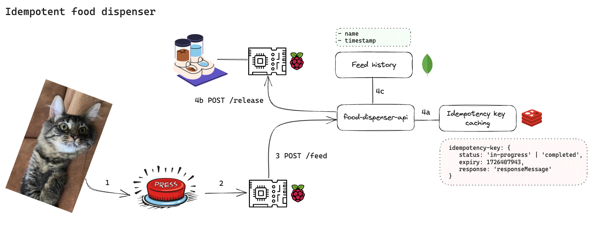

# Idempotent Food Dispenser

## Project description
What excites Kristen (aka. acceptance criteria)?
- Build something fun: Make Chinsu eat well. 
- Get hands dirty on hardware
- Implement idempotent API with Spring Boot using idempotency key
- Use Redis for caching idempotency keys
- Create CI/CD pipeline with GitHub Actions: can I deploy locally?

## Architecture



## How to run
```shell
cd infra
docker compose up -d
```

```shell
cd infra
docker compose down
```

```shell
// Once Redis container starts, use Redis CLI to create a new key/value pair: key=name, value=kristen
redis-cli -h localhost -p 6379
set name kristen
get name
del name
get name
exit
```