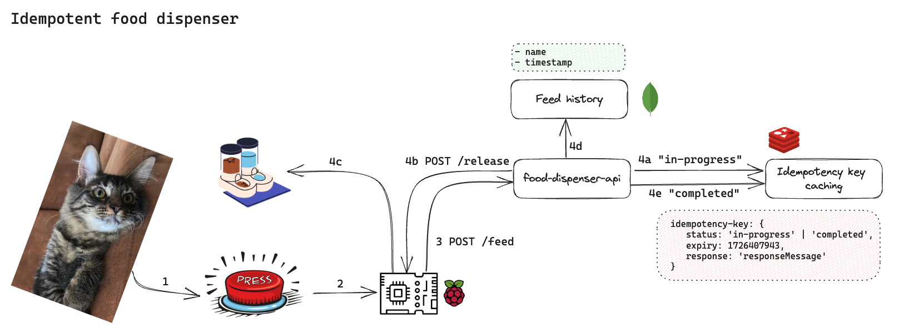

# Idempotent Food Dispenser

## Project description
What excites Kristen (aka. acceptance criteria)?
- Build something fun: Make Chinsu eat well. 
- Get hands dirty on hardware
- Implement idempotent API with Spring Boot using idempotency key
- Use Redis for caching idempotency keys
- Create CI/CD pipeline with GitHub Actions: can I deploy locally?

## Architecture



## How to run
```shell
cd infra
docker compose up -d
```

```shell
cd infra
docker compose down
```

```shell
// Once Redis container starts, use Redis CLI to create a new key/value pair with time-to-live: key=name, value=kristen
redis-cli -h localhost -p 6379

// KEY-VALUE PAIRS: Create a key/value pair and later add expiry time
set name kristen
expire name 10
get name

// KEY-VALUE PAIRS: Create a key/value pair and expiry at once
setex name 10 kristen

// KEY-VALUE PAIRS: Check if a key exists. Check TTL. List all keys. Delete key(s). 
exists name
ttl name
keys *
del name
flushall

// LIST AKA ARRAY: Push a new value to the top of a list aka to the left using "lpush". Else "rpush". Remove using "lpop" or "rpop". View the list using "lrange" instead of "get"
lpush names kristen
lpush names pittt
lrange friends 0 -1
lpop names
rpop names

// SET: A list where every value in the set is unique. Add/ remove/ view the set using "sadd", "srem", and "smembers"
sadd friends kristen
sadd friends pittt
srem friends kristen
smembers friends

// HASH: Store key-value pairs inside a key. parent key=user1. Inside this key, we have key=name value = kristen, key=age value=31. 
hset user1 name kristen
hset user1 age 31
hgetall user1
hget user1 name
hdel user1 name
exit
```